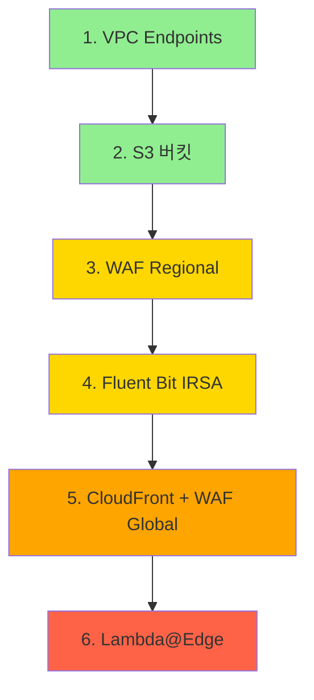

# Phase-3 보안 & 모니터링 고도화 런북

> **버전**: 1.1  
> **작성일**: 2026-01-04  
> **대상 환경**: MGMT / DEV / STAGE / PROD  
> **리전**: ap-northeast-3 (Osaka) 기본, us-east-1 (예외)  
> **목표**: WAF 도입, 중앙 로그 수집, CloudFront CDN, Lambda@Edge 캐싱 최적화

---

## 아키텍처 원칙 (절대 준수)

> ⛔ **이 원칙을 어기는 설계는 절대 금지**

| 관리 주체 | 리소스 |
|----------|--------|
| **Terraform** | VPC, Subnet, NAT, VPC Endpoint, EKS Control Plane, RDS, Redis/Valkey, S3, IAM, CloudFront, WAF |
| **EKS + AWS LB Controller** | ALB (Ingress에 의해 자동 생성) |
| **ArgoCD + GitOps** | Deployment, Service, Ingress, ConfigMap, Secret |

```
❌ 잘못된 설계: Terraform에서 ALB 직접 생성
✅ 올바른 설계: Ingress 배포 → ALB Controller가 ALB 자동 생성
```

---

## 목차

1. [리전 정책](#1-리전-정책)
2. [비용 절감 전략](#2-비용-절감-전략)
3. [VPC Endpoints 구현](#3-vpc-endpoints-구현)
4. [S3 버킷 구현](#4-s3-버킷-구현)
5. [WAF 도입](#5-waf-도입)
6. [로그 & 모니터링](#6-로그--모니터링)
7. [CloudFront 도입](#7-cloudfront-도입)
8. [Lambda@Edge 적용](#8-lambdaedge-적용)
9. [적용 순서 및 체크리스트](#9-적용-순서-및-체크리스트)
10. [운영 주의사항](#10-운영-주의사항)

---

## 1. 리전 정책

### 1.1. 리전 구분표

| 구분 | 리전 | 대상 리소스 |
|:----:|:----:|------------|
| **기본 운영 리전** | `ap-northeast-3` (Osaka) | VPC, EKS, RDS, Redis, NAT, VPC Endpoint, S3, CloudWatch, WAF (Regional) |
| **예외 리전** | `us-east-1` (N. Virginia) | CloudFront, Lambda@Edge, CloudFront용 ACM 인증서, WAF (Global) |

### 1.2. 리전별 Provider 설정

```hcl
# providers.tf

# 기본 리전 (Osaka)
provider "aws" {
  region = "ap-northeast-3"
  alias  = "osaka"
}

# 예외 리전 (CloudFront, Lambda@Edge)
provider "aws" {
  region = "us-east-1"
  alias  = "virginia"
}
```

### 1.3. CLI 명령어 리전 규칙

```powershell
# 기본 리소스 (EKS, RDS, S3 등)
aws eks list-clusters --region ap-northeast-3

# CloudFront 관련
aws cloudfront list-distributions --region us-east-1

# Lambda@Edge
aws lambda list-functions --region us-east-1 --query "Functions[?contains(FunctionName, 'edge')]"

# CloudFront용 ACM
aws acm list-certificates --region us-east-1
```

> ⚠️ **주의**: CloudFront용 ACM 인증서는 **반드시 us-east-1**에서 생성해야 합니다.

---

## 2. 비용 절감 전략

### 2.1. 리소스 분류

#### ❌ 중지 가능 (고비용, 미사용 시 절감 효과 높음)

| 리소스 | 중지 방법 | 월 예상 비용 | 절감 효과 |
|--------|----------|:----------:|:--------:|
| EKS Node Group | `desiredSize=0` | $150-500 | 💰💰💰 |
| RDS 인스턴스 | 콘솔/CLI 중지 | $50-200 | 💰💰 |
| NAT Gateway | 삭제 (EIP 유지) | $45+/월 | 💰 |

#### ⚠️ 중지 시 영향 있음

| 리소스 | 영향 | 권장 |
|--------|------|------|
| ElastiCache | 세션/캐시 데이터 손실 | 스냅샷 후 삭제 가능 |
| NAT Gateway | EKS → 이미지 pull 불가 | 완전 미사용 시만 삭제 |

#### ⛔ 중지 금지 (무료 또는 재구성 복잡)

| 리소스 | 이유 |
|--------|------|
| VPC, Subnet, Route Table | 무료, 삭제 시 전체 재구성 |
| IAM Role/Policy | 무료, IRSA 연동 깨짐 |
| S3 (tfstate, logs) | 삭제 시 복구 불가 |
| ACM 인증서 | 무료, 삭제 시 HTTPS 불가 |

### 2.2. 환경별 절감 전략

| 환경 | 평일 업무시간 외 | 주말 | 장기 미사용 |
|:----:|:---------------:|:----:|:----------:|
| **DEV** | 노드 0 + RDS 중지 | 노드 0 + RDS 중지 | Terraform destroy |
| **STAGE** | 노드 1 유지 | 노드 0 + RDS 중지 | 노드 0 + RDS 중지 |
| **PROD** | ⛔ 변경 금지 | ⛔ 변경 금지 | ⛔ 변경 금지 |

```powershell
# DEV 노드 축소
aws eks update-nodegroup-config \
  --cluster-name min-kyeol-dev-eks \
  --nodegroup-name min-kyeol-dev-ng \
  --scaling-config minSize=0,desiredSize=0,maxSize=3 \
  --region ap-northeast-3

# DEV RDS 중지 (최대 7일, 이후 자동 재시작)
aws rds stop-db-instance \
  --db-instance-identifier min-kyeol-dev-rds \
  --region ap-northeast-3
```

---

## 3. VPC Endpoints 구현

### 3.1. 왜 VPC Endpoint가 필요한가?

```
[Endpoint 없음]
EKS Pod → NAT Gateway → Internet → S3/ECR → 응답
         ↑ 비용 발생 (데이터 전송료 + NAT 처리비용)

[Endpoint 있음]
EKS Pod → VPC Endpoint → S3/ECR → 응답
         ↑ 무료 (AWS 내부망)
```

### 3.2. Endpoint 단계별 적용

| 단계 | Endpoint | 유형 | NAT 절감 효과 | 적용 환경 |
|:----:|----------|:----:|:------------:|:--------:|
| **필수** | S3 | Gateway | 💰💰💰 | 전체 |
| 1단계 | ECR API + DKR | Interface | 💰💰 | STAGE, PROD |
| 2단계 | CloudWatch Logs | Interface | 💰 | STAGE, PROD |
| 3단계 | STS | Interface | 💰 | PROD |

### 3.3. Terraform 구현

**파일**: `modules/vpc/endpoints.tf`

```hcl
# -----------------------------------------------------------------------------
# [필수] S3 Gateway Endpoint - 무료, NAT 비용 대폭 절감
# -----------------------------------------------------------------------------
resource "aws_vpc_endpoint" "s3" {
  count = var.enable_vpc_endpoints ? 1 : 0

  vpc_id            = aws_vpc.main.id
  service_name      = "com.amazonaws.${var.region}.s3"
  vpc_endpoint_type = "Gateway"

  route_table_ids = concat(
    [for rt in aws_route_table.private : rt.id],
    [for rt in aws_route_table.public : rt.id]
  )

  tags = merge(var.tags, {
    Name    = "${var.name_prefix}-s3-endpoint"
    Purpose = "S3 access without NAT"
  })
}

# -----------------------------------------------------------------------------
# [선택] ECR Endpoints - 이미지 pull 시 NAT 비용 절감
# -----------------------------------------------------------------------------
resource "aws_vpc_endpoint" "ecr_api" {
  count = var.enable_ecr_endpoints ? 1 : 0

  vpc_id              = aws_vpc.main.id
  service_name        = "com.amazonaws.${var.region}.ecr.api"
  vpc_endpoint_type   = "Interface"
  subnet_ids          = aws_subnet.app_private[*].id
  security_group_ids  = [aws_security_group.vpc_endpoints[0].id]
  private_dns_enabled = true

  tags = merge(var.tags, {
    Name = "${var.name_prefix}-ecr-api-endpoint"
  })
}

resource "aws_vpc_endpoint" "ecr_dkr" {
  count = var.enable_ecr_endpoints ? 1 : 0

  vpc_id              = aws_vpc.main.id
  service_name        = "com.amazonaws.${var.region}.ecr.dkr"
  vpc_endpoint_type   = "Interface"
  subnet_ids          = aws_subnet.app_private[*].id
  security_group_ids  = [aws_security_group.vpc_endpoints[0].id]
  private_dns_enabled = true

  tags = merge(var.tags, {
    Name = "${var.name_prefix}-ecr-dkr-endpoint"
  })
}

# -----------------------------------------------------------------------------
# [선택] CloudWatch Logs Endpoint - 로그 전송 시 NAT 비용 절감
# -----------------------------------------------------------------------------
resource "aws_vpc_endpoint" "logs" {
  count = var.enable_logs_endpoint ? 1 : 0

  vpc_id              = aws_vpc.main.id
  service_name        = "com.amazonaws.${var.region}.logs"
  vpc_endpoint_type   = "Interface"
  subnet_ids          = aws_subnet.app_private[*].id
  security_group_ids  = [aws_security_group.vpc_endpoints[0].id]
  private_dns_enabled = true

  tags = merge(var.tags, {
    Name = "${var.name_prefix}-logs-endpoint"
  })
}

# -----------------------------------------------------------------------------
# Endpoint용 Security Group
# -----------------------------------------------------------------------------
resource "aws_security_group" "vpc_endpoints" {
  count = var.enable_vpc_endpoints ? 1 : 0

  name        = "${var.name_prefix}-vpc-endpoints-sg"
  description = "Security group for VPC Endpoints"
  vpc_id      = aws_vpc.main.id

  ingress {
    from_port   = 443
    to_port     = 443
    protocol    = "tcp"
    cidr_blocks = [var.vpc_cidr]
  }

  tags = merge(var.tags, {
    Name = "${var.name_prefix}-vpc-endpoints-sg"
  })
}
```

---

## 4. S3 버킷 구현

### 4.1. 버킷 분리 원칙

| 용도 | 버킷 이름 | 접근 주체 | 보존 기간 |
|------|----------|----------|----------|
| 미디어/이미지 | `${prefix}-media` | 앱, CloudFront | 영구 |
| 서비스 로그 | `${prefix}-logs` | ALB, WAF, CloudFront | 90일 |
| Terraform State | `${prefix}-tfstate` | Terraform | 영구 |

### 4.2. 보안 기본값 (ISMS-P 준수)

> ⚠️ **모든 S3 버킷에 아래 설정 필수 적용**

| 설정 | 값 | 보안 근거 |
|------|---|----------|
| Block Public Access | **전체 차단** | 공개 유출 방지 |
| Server-Side Encryption | SSE-S3 (기본) 또는 KMS | 저장 데이터 암호화 |
| Object Ownership | BucketOwnerEnforced | ACL 비활성화 |
| Versioning | 활성화 (tfstate, media) | 실수 복구 |
| Lifecycle | 로그 90일 후 삭제 | 비용 관리 |

### 4.3. Terraform 구현

**파일**: `modules/s3/main.tf`

```hcl
# -----------------------------------------------------------------------------
# 미디어 버킷 (이미지, 정적 파일)
# -----------------------------------------------------------------------------
resource "aws_s3_bucket" "media" {
  bucket = "${var.name_prefix}-media"
  
  tags = merge(var.tags, {
    Purpose = "media-storage"
  })
}

resource "aws_s3_bucket_versioning" "media" {
  bucket = aws_s3_bucket.media.id
  versioning_configuration {
    status = "Enabled"
  }
}

resource "aws_s3_bucket_server_side_encryption_configuration" "media" {
  bucket = aws_s3_bucket.media.id
  rule {
    apply_server_side_encryption_by_default {
      sse_algorithm = "AES256"
    }
  }
}

resource "aws_s3_bucket_public_access_block" "media" {
  bucket = aws_s3_bucket.media.id

  block_public_acls       = true
  block_public_policy     = true
  ignore_public_acls      = true
  restrict_public_buckets = true
}

resource "aws_s3_bucket_ownership_controls" "media" {
  bucket = aws_s3_bucket.media.id
  rule {
    object_ownership = "BucketOwnerEnforced"
  }
}

# -----------------------------------------------------------------------------
# 로그 버킷 (ALB, WAF, CloudFront 로그)
# -----------------------------------------------------------------------------
resource "aws_s3_bucket" "logs" {
  bucket = "${var.name_prefix}-logs"
  
  tags = merge(var.tags, {
    Purpose = "log-storage"
  })
}

resource "aws_s3_bucket_lifecycle_configuration" "logs" {
  bucket = aws_s3_bucket.logs.id

  rule {
    id     = "expire-old-logs"
    status = "Enabled"

    expiration {
      days = 90
    }

    noncurrent_version_expiration {
      noncurrent_days = 30
    }
  }
}

# 로그 버킷도 동일하게 암호화 + Public Access 차단 적용
# (위 media 버킷과 동일 패턴, 생략)
```

---

## 5. WAF 도입

### 5.1. WAF 적용 대상

| 대상 | WAF Scope | 연결 방식 |
|------|-----------|----------|
| ALB (환경별) | `REGIONAL` | ALB ARN 연결 |
| CloudFront | `CLOUDFRONT` | Distribution 연결 |

### 5.2. 룰 구성 전략

```hcl
# modules/waf/main.tf

resource "aws_wafv2_web_acl" "main" {
  provider = aws.osaka  # Regional WAF

  name        = "${var.name_prefix}-waf"
  scope       = "REGIONAL"
  description = "WAF for ALB protection"

  default_action {
    allow {}
  }

  # 1. AWS Core Rule Set (필수)
  rule {
    name     = "AWSManagedRulesCommonRuleSet"
    priority = 1

    override_action {
      none {}
    }

    statement {
      managed_rule_group_statement {
        name        = "AWSManagedRulesCommonRuleSet"
        vendor_name = "AWS"
      }
    }

    visibility_config {
      sampled_requests_enabled   = true
      cloudwatch_metrics_enabled = true
      metric_name                = "CommonRuleSet"
    }
  }

  # 2. SQL Injection 방어 (필수)
  rule {
    name     = "AWSManagedRulesSQLiRuleSet"
    priority = 2
    
    override_action { none {} }
    
    statement {
      managed_rule_group_statement {
        name        = "AWSManagedRulesSQLiRuleSet"
        vendor_name = "AWS"
      }
    }

    visibility_config {
      sampled_requests_enabled   = true
      cloudwatch_metrics_enabled = true
      metric_name                = "SQLiRuleSet"
    }
  }

  # 3. Rate Limiting (커스텀)
  rule {
    name     = "RateLimitRule"
    priority = 10

    action {
      block {}
    }

    statement {
      rate_based_statement {
        limit              = 2000  # 5분당 2000 요청
        aggregate_key_type = "IP"
      }
    }

    visibility_config {
      sampled_requests_enabled   = true
      cloudwatch_metrics_enabled = true
      metric_name                = "RateLimit"
    }
  }

  visibility_config {
    sampled_requests_enabled   = true
    cloudwatch_metrics_enabled = true
    metric_name                = "${var.name_prefix}-waf"
  }

  tags = var.tags
}

# WAF → ALB 연결
resource "aws_wafv2_web_acl_association" "alb" {
  resource_arn = var.alb_arn
  web_acl_arn  = aws_wafv2_web_acl.main.arn
}
```

### 5.3. WAF 로그 저장 설계

| 방식 | 용도 | 비용 | 언제 사용 |
|------|------|:----:|----------|
| **S3** (필수) | 장기 보관, 감사, 포렌식 | 💰 | 항상 |
| CloudWatch Logs (선택) | 실시간 탐지, 알람 | 💰💰 | 운영 모니터링 필요 시 |

```hcl
# WAF 로그 → S3 (필수)
resource "aws_wafv2_web_acl_logging_configuration" "main" {
  log_destination_configs = [aws_s3_bucket.logs.arn]
  resource_arn            = aws_wafv2_web_acl.main.arn

  logging_filter {
    default_behavior = "DROP"  # 차단된 요청만 로깅

    filter {
      behavior    = "KEEP"
      condition {
        action_condition {
          action = "BLOCK"
        }
      }
      requirement = "MEETS_ANY"
    }
  }
}
```

> 💡 **Tip**: 운영 초기에는 `default_behavior = "KEEP"`으로 모든 요청을 로깅하고, 안정화 후 `DROP`으로 변경하여 비용 절감

---

## 6. 로그 & 모니터링

### 6.1. 로그 수집 대상

| 로그 유형 | 소스 | 저장 위치 | 보존 기간 |
|----------|------|----------|----------|
| WAF 로그 | WAF | S3 | 90일 |
| ALB Access Log | ALB | S3 | 30일 |
| CloudFront Access Log | CloudFront | S3 | 30일 |
| EKS Control Plane | EKS | CloudWatch | 30일 |
| 애플리케이션 로그 | Pods (Fluent Bit) | CloudWatch | 14일 |

### 6.2. Fluent Bit IRSA 구성 (필수)

> ⛔ **Node IAM 권한 사용 금지** - 최소 권한 원칙 위반, 보안 감사 지적 대상

**파일**: `modules/eks/fluent_bit_irsa.tf`

```hcl
# Fluent Bit 전용 IAM Role
resource "aws_iam_role" "fluent_bit" {
  count = var.enable_fluent_bit_irsa ? 1 : 0

  name = "${var.name_prefix}-fluent-bit-role"

  assume_role_policy = jsonencode({
    Version = "2012-10-17"
    Statement = [{
      Effect = "Allow"
      Principal = {
        Federated = local.oidc_provider_arn
      }
      Action = "sts:AssumeRoleWithWebIdentity"
      Condition = {
        StringEquals = {
          "${local.cluster_oidc_issuer}:aud" = "sts.amazonaws.com"
          "${local.cluster_oidc_issuer}:sub" = "system:serviceaccount:amazon-cloudwatch:fluent-bit"
        }
      }
    }]
  })

  tags = var.tags
}

# Fluent Bit 최소 권한 Policy
resource "aws_iam_role_policy" "fluent_bit" {
  count = var.enable_fluent_bit_irsa ? 1 : 0

  name = "${var.name_prefix}-fluent-bit-policy"
  role = aws_iam_role.fluent_bit[0].id

  policy = jsonencode({
    Version = "2012-10-17"
    Statement = [{
      Effect = "Allow"
      Action = [
        "logs:CreateLogGroup",
        "logs:CreateLogStream",
        "logs:PutLogEvents",
        "logs:DescribeLogGroups",
        "logs:DescribeLogStreams"
      ]
      Resource = "arn:aws:logs:${var.region}:*:log-group:/aws/eks/${var.cluster_name}/*"
    }]
  })
}
```

**Fluent Bit Helm Values**:

```yaml
# kyeol-platform-gitops/clusters/{env}/values/fluent-bit.values.yaml
serviceAccount:
  create: true
  name: fluent-bit
  annotations:
    eks.amazonaws.com/role-arn: "arn:aws:iam::${ACCOUNT_ID}:role/${PREFIX}-fluent-bit-role"

config:
  outputs: |
    [OUTPUT]
        Name cloudwatch_logs
        Match *
        region ap-northeast-3
        log_group_name /aws/eks/${CLUSTER_NAME}/containers
        log_stream_prefix fluentbit-
        auto_create_group true
```

---

## 7. CloudFront 도입

### 7.1. Origin 도메인 설계 (중요)

> ⛔ **ALB DNS 직접 참조 금지** - Ingress 재배포 시 ALB 교체되면 CloudFront 장애 발생

**올바른 설계**:

```
[CloudFront]
    ↓ Origin: origin-prod.msp-g1.click
[Route53] origin-prod.msp-g1.click → ALIAS → ALB DNS
    ↓
[ALB] (Ingress에 의해 생성)
```

**Route53 레코드 생성**:

```hcl
# Origin 도메인 (환경별)
resource "aws_route53_record" "origin" {
  zone_id = var.hosted_zone_id
  name    = "origin-${var.environment}.${var.domain}"
  type    = "A"

  alias {
    name                   = var.alb_dns_name  # 동적 참조
    zone_id                = var.alb_zone_id
    evaluate_target_health = true
  }
}
```

**장점**:
- Ingress 재배포 → ALB 교체 → Route53만 업데이트
- CloudFront 설정 변경 없음
- DNS 전파 완료 후 자동 복구

### 7.2. CloudFront Terraform 구현

**파일**: `modules/cloudfront/main.tf`

```hcl
resource "aws_cloudfront_distribution" "main" {
  provider = aws.virginia  # CloudFront는 us-east-1

  enabled             = true
  is_ipv6_enabled     = true
  comment             = "${var.name_prefix} CDN"
  default_root_object = "index.html"
  aliases             = var.domain_aliases
  price_class         = "PriceClass_200"  # 아시아/유럽/북미

  origin {
    # ✅ ALB DNS가 아닌 Origin 도메인 사용
    domain_name = "origin-${var.environment}.${var.domain}"
    origin_id   = "alb-origin"

    custom_origin_config {
      http_port              = 80
      https_port             = 443
      origin_protocol_policy = "https-only"
      origin_ssl_protocols   = ["TLSv1.2"]
    }
  }

  default_cache_behavior {
    allowed_methods        = ["GET", "HEAD", "OPTIONS", "PUT", "POST", "PATCH", "DELETE"]
    cached_methods         = ["GET", "HEAD"]
    target_origin_id       = "alb-origin"
    viewer_protocol_policy = "redirect-to-https"
    compress               = true

    cache_policy_id          = aws_cloudfront_cache_policy.default.id
    origin_request_policy_id = aws_cloudfront_origin_request_policy.default.id
  }

  viewer_certificate {
    acm_certificate_arn      = var.acm_certificate_arn  # us-east-1 ACM
    ssl_support_method       = "sni-only"
    minimum_protocol_version = "TLSv1.2_2021"
  }

  restrictions {
    geo_restriction {
      restriction_type = "none"
    }
  }

  # WAF 연결 (Global WAF)
  web_acl_id = var.waf_global_arn

  logging_config {
    include_cookies = false
    bucket          = "${var.logs_bucket}.s3.amazonaws.com"
    prefix          = "cloudfront/${var.environment}/"
  }

  tags = var.tags
}

# 캐시 정책
resource "aws_cloudfront_cache_policy" "default" {
  provider = aws.virginia

  name        = "${var.name_prefix}-cache-policy"
  min_ttl     = 0
  default_ttl = 86400   # 1일
  max_ttl     = 31536000 # 1년

  parameters_in_cache_key_and_forwarded_to_origin {
    cookies_config {
      cookie_behavior = "none"
    }
    headers_config {
      header_behavior = "none"
    }
    query_strings_config {
      query_string_behavior = "none"
    }
  }
}
```

---

## 8. Lambda@Edge 적용

### 8.1. 왜 마지막 단계인가? (위험도)

| 위험 요소 | 설명 |
|----------|------|
| ⛔ VPC 접근 불가 | Lambda@Edge는 VPC 내부 리소스에 접근 불가 |
| ⚠️ 디버깅 어려움 | CloudWatch 로그가 실행된 엣지 로케이션에 분산 |
| ⚠️ 롤백 시간 | CloudFront 전파 완료까지 15-30분 소요 |
| ⚠️ 캐시 오류 시 전역 장애 | 잘못된 캐시 설정 시 모든 사용자 영향 |

### 8.2. 적용 전 선행 조건

- [ ] CloudFront 정상 동작 확인 (2주 이상 운영)
- [ ] 캐시 정책 검증 완료
- [ ] 스테이징 환경에서 테스트 완료
- [ ] 롤백 계획 수립

### 8.3. Lambda@Edge 구현

**파일**: `modules/lambda_edge/main.tf`

```hcl
provider "aws" {
  alias  = "virginia"
  region = "us-east-1"  # ⚠️ Lambda@Edge는 반드시 us-east-1
}

resource "aws_lambda_function" "edge" {
  provider = aws.virginia

  filename         = data.archive_file.lambda.output_path
  function_name    = "${var.name_prefix}-edge-function"
  role             = aws_iam_role.lambda_edge.arn
  handler          = "index.handler"
  source_code_hash = data.archive_file.lambda.output_base64sha256
  runtime          = "nodejs18.x"
  timeout          = 5  # Viewer: 최대 5초
  memory_size      = 128
  publish          = true

  tags = var.tags
}

# Lambda@Edge용 IAM Role
resource "aws_iam_role" "lambda_edge" {
  provider = aws.virginia

  name = "${var.name_prefix}-lambda-edge-role"

  assume_role_policy = jsonencode({
    Version = "2012-10-17"
    Statement = [{
      Effect = "Allow"
      Principal = {
        Service = [
          "lambda.amazonaws.com",
          "edgelambda.amazonaws.com"
        ]
      }
      Action = "sts:AssumeRole"
    }]
  })
}
```

### 8.4. Lambda@Edge 코드 예시

```javascript
// lambda/origin-request/index.js
exports.handler = async (event) => {
  const request = event.Records[0].cf.request;
  const uri = request.uri;

  // 정적 자산에 장기 캐시 헤더 추가
  if (uri.match(/\.(js|css|png|jpg|gif|ico|woff2)$/)) {
    request.headers['cache-control'] = [{
      key: 'Cache-Control',
      value: 'public, max-age=31536000, immutable'
    }];
  }

  return request;
};
```

### 8.5. 롤백 절차

```powershell
# 1. 이전 Lambda 버전으로 CloudFront 업데이트
aws cloudfront update-distribution \
  --id E1234567890 \
  --distribution-config file://rollback-config.json \
  --region us-east-1

# 2. Invalidation 생성 (캐시 무효화)
aws cloudfront create-invalidation \
  --distribution-id E1234567890 \
  --paths "/*" \
  --region us-east-1

# 3. 전파 완료 대기 (15-30분)
aws cloudfront wait distribution-deployed --id E1234567890
```

---

## 9. 적용 순서 및 체크리스트

### 9.1. 단계별 적용 순서



### 9.2. 환경별 적용 전략

| 단계 | 리소스 | DEV | STAGE | PROD |
|:----:|--------|:---:|:-----:|:----:|
| 1 | S3 VPC Endpoint | ✅ | ✅ | ✅ |
| 1 | S3 버킷 (media, logs) | ✅ | ✅ | ✅ |
| 2 | ECR Endpoints | ❌ | ✅ | ✅ |
| 2 | WAF (ALB) | ✅ | ✅ | ✅ |
| 3 | Fluent Bit IRSA | ✅ | ✅ | ✅ |
| 3 | CloudWatch Logs Endpoint | ❌ | ✅ | ✅ |
| 4 | CloudFront | ❌ | ✅ (테스트) | ✅ |
| 4 | WAF (CloudFront) | ❌ | ✅ | ✅ |
| 5 | Lambda@Edge | ❌ | ❌ | ⚠️ 선택 |

### 9.3. 완료 체크리스트

#### Phase 3-1: 기반 인프라

- [ ] S3 VPC Endpoint 생성 (전 환경)
- [ ] S3 버킷 생성 (media, logs)
- [ ] S3 보안 설정 확인 (Block Public, Encryption)

#### Phase 3-2: 보안

- [ ] WAF Web ACL 생성 (Regional)
- [ ] WAF → ALB 연결
- [ ] WAF 로그 → S3 설정
- [ ] Count 모드로 2주 모니터링 후 Block 전환

#### Phase 3-3: 모니터링

- [ ] Fluent Bit IRSA Role 생성
- [ ] Fluent Bit DaemonSet 배포
- [ ] CloudWatch 로그 그룹 생성 확인
- [ ] (선택) CloudWatch Logs Endpoint 생성

#### Phase 3-4: CDN

- [ ] Origin 도메인 Route53 레코드 생성
- [ ] CloudFront Distribution 생성
- [ ] CloudFront ACM 인증서 연결 (us-east-1)
- [ ] CloudFront → WAF Global 연결
- [ ] 캐시 정책 검증

#### Phase 3-5: 고급 최적화 (선택)

- [ ] Lambda@Edge 개발 (스테이징 테스트)
- [ ] Lambda@Edge 배포 (PROD)
- [ ] 성능 모니터링

---

## 10. 운영 주의사항

### 10.1. WAF 운영

| 항목 | 권장 |
|------|------|
| 초기 모드 | **Count 모드**로 시작, 로그 분석 후 Block 전환 |
| Rate Limit | 너무 낮으면 정상 트래픽도 차단, 점진적 조정 |
| 화이트리스트 | 내부 IP, 모니터링 봇 예외 처리 |
| 룰 업데이트 | AWS Managed Rules 자동 업데이트 주기 확인 |

### 10.2. CloudFront 운영

| 항목 | 주의 |
|------|------|
| 캐시 무효화 | 1,000건 이후 $0.005/경로 비용 발생 |
| TTL 설정 | 동적 콘텐츠에 긴 TTL 설정 금지 |
| Origin 도메인 | ALB 교체 시 Route53 업데이트 확인 |

### 10.3. Lambda@Edge 운영

| 항목 | 제한/주의 |
|------|----------|
| 패키지 크기 | 최대 1MB |
| 타임아웃 | Viewer: 5초, Origin: 30초 |
| VPC | 접근 불가 |
| 배포 리전 | us-east-1 고정 |
| 롤백 | 전파 완료까지 15-30분 소요 |

### 10.4. 롤백 포인트

| 단계 | 롤백 방법 | 소요 시간 |
|------|----------|:--------:|
| VPC Endpoint | Terraform destroy | 1분 |
| WAF | Web ACL Association 해제 | 1분 |
| CloudFront | Distribution 비활성화 | 15분 |
| Lambda@Edge | 이전 버전으로 Association 변경 | 30분 |

---

## 산출물 요약

| 산출물 | 설명 |
|--------|------|
| VPC Endpoints Terraform | `modules/vpc/endpoints.tf` |
| S3 버킷 Terraform | `modules/s3/main.tf` |
| WAF Terraform | `modules/waf/main.tf` |
| Fluent Bit IRSA Terraform | `modules/eks/fluent_bit_irsa.tf` |
| CloudFront Terraform | `modules/cloudfront/main.tf` |
| Lambda@Edge Terraform | `modules/lambda_edge/main.tf` |

---

> **문서 끝**  
> **버전 히스토리**:  
> - v1.0 (2026-01-03): 초안 작성  
> - v1.1 (2026-01-04): 리전 정책, Origin 도메인 설계, IRSA, 보안 강화, 적용 순서 상세화
